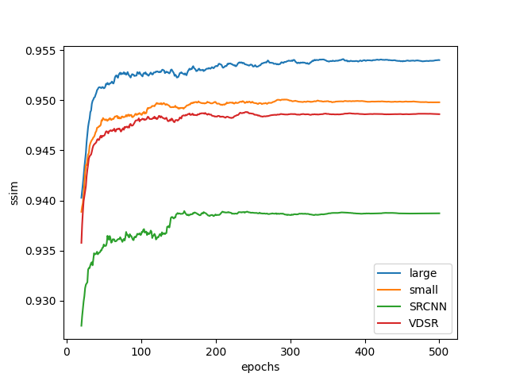
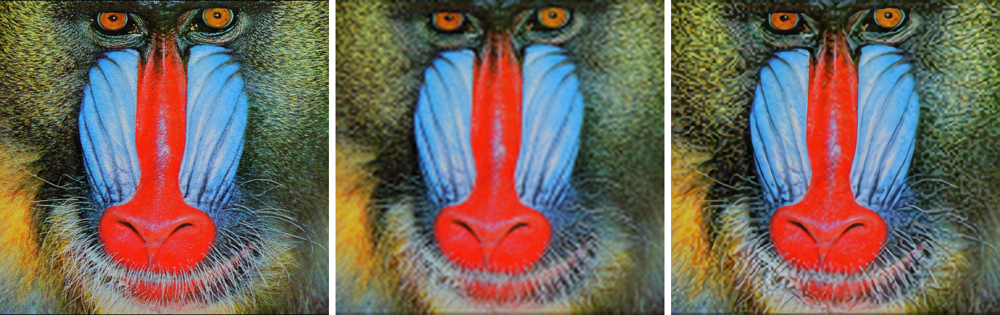
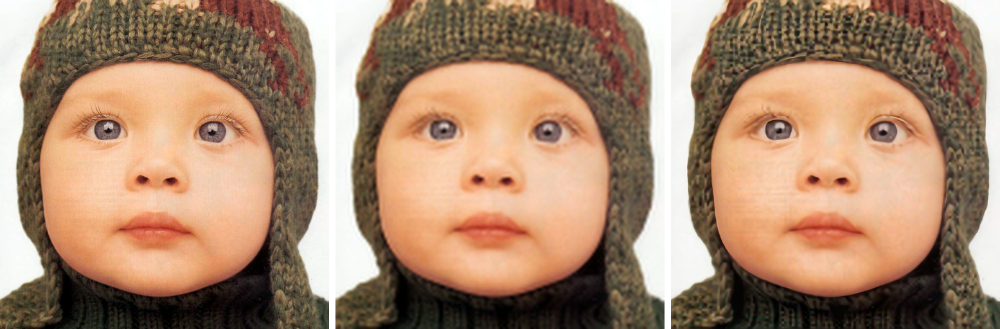
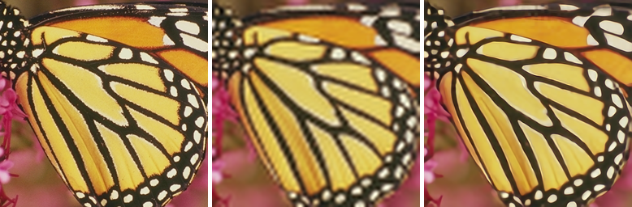
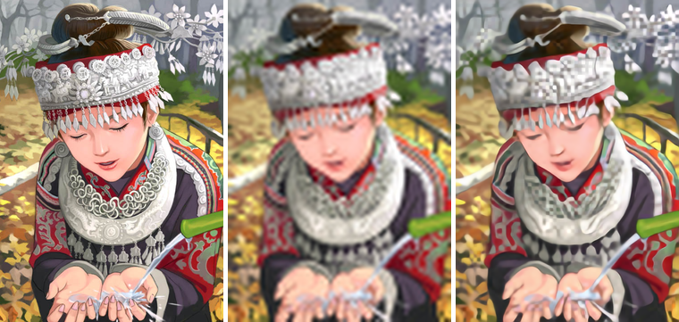
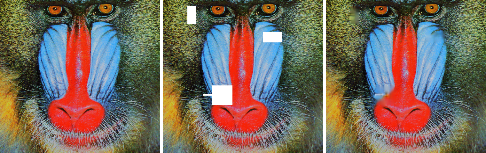
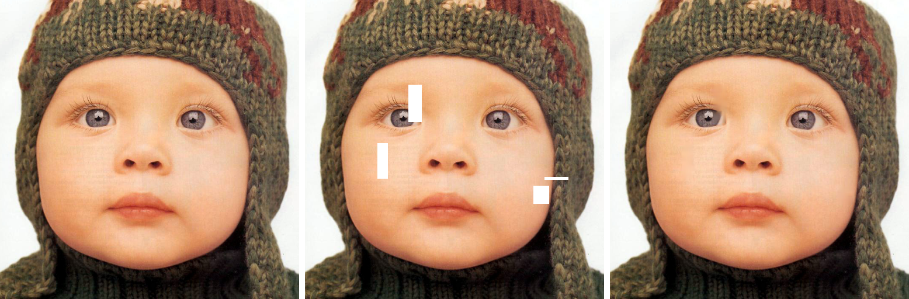
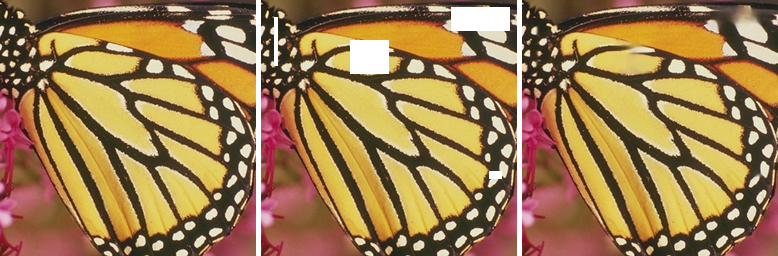

# Super Resolution & Image Inpainting

### Purpose of this project
* Learn about Convolutional Neural Networks
* Discover the intracacies of training large neurla nets
* Learn about state of the art approaches to image restoration techniques

#### Notes:
For a more indepth explaination of my implementations of these neural networks visit my other Github pages and my presentation.
  * [Presentation Link](https://docs.google.com/presentation/d/1qXYvsdvY7xx_EAyjxPaJb84iO7sHpkBMH7JhRhaoGGA/edit?usp=sharing)
  * [Super-Resolution](https://github.com/JoshVEvans/Super-Resolution)
  * [Inpainting](https://github.com/JoshVEvans/Image-Inpainting)
  * [GAN] - this was not part of my presentation, but I found it necessary to learn about GANs since they are such an important topic today with regard to image models.

## 1. Super-Resolution
I took inspiration from and implemented [SRCNN](https://arxiv.org/pdf/1501.00092.pdf) and [VDSR](https://arxiv.org/pdf/1511.04587.pdf). My final model is based on a [RESNET](https://arxiv.org/pdf/1512.03385.pdf) style architecture.

I created two resnet style models one with over 7mil parameters and another with 2mil parameters. The larger model ran too long and would certainly run out of memory on less powerful machines like laptops, so I saw the need to create a smaller architecture that had less layers along with replacing the `Add` layers found in RESNET with `Concatenate` layers to add the residuals. I found that this change cut the runtime of the model during inference along with having the capability to run on my laptop.

### Model Architecture Comparison

| Methods                    | Depth |      Filters      | Parameters |         SSIM-x2         | PSNR-x2 | Training Time |
| -------------------------- | :---: | :---------------: | :--------: | :---------------------: | :-----: | :-----------: |
| Bicubic                    |   ~   |         ~         |     ~      |         0.9201          | 32.4975 |       ~       |
| SRCNN                      |   3   |      64-32-3      |    20k     |         0.9389          | 36.113  |     6hrs      |
| VDSR                       |  20   | (19 layers) 64-3  |    668k    |         0.9488          | 37.3448 |     8hrs      |
| Small                      |  20   | (19 layers) 64-3  |   2,013k   |         0.9501          | 37.5013 |     15hrs     |
| Large                      |  50   | (49 layers) 128-3 |   7,091k   | <strong>0.9541</strong> |
| <strong>37.9479  </strong> | 23hrs |

### Training Details:
* Trained on the DIV2K & FLICKR2K datset
* All models trained across 500k iterations
* Starting learning rate of 1e-4 halfing every 25k iterations
* A detailed slide on image augmentation is explained in my [presentation](https://docs.google.com/presentation/d/1qXYvsdvY7xx_EAyjxPaJb84iO7sHpkBMH7JhRhaoGGA/edit?usp=sharing)

### Architecture Performance

## Qualitative Examples (click on the images for higher quality):
#### Set 5 Evaluation Set:
Images Left to Right: Original, Nearest Neighbor, Predicted.

2x interpolation

4x interpolation

## 1. Image Inpainting
Implmenting Inpainting proved to be a much simpler task after my understanding of image datsets that I gained in SR. I only had the ability to train a single successful Inpainting model as this required a much larger network to get even mediocre results. As I expected, to get 'good' inapinting models, I would require much more powerful hardware.

My hypothesis as to why inpainting requires a larger network to function is that the task (inpainting) requires the network to remember and recreate features that it memorized from the training data. In Super-Resolution, the task was much simpler since the process of translating the low resolution image to a higher resolution seemed to resemble a very sophisticated image sharpening algorithm. I certainly likely to be wrong with this with my very limited knowledge - I could have simply been wrong in the architecture implemented.

### Model Architecture

| Methods       | Depth |      Filters      | Parameters | Training Time |
| ------------- | :---: | :---------------: | :--------: | :-----------: |
| Inpaint Model |  50   | (49 layers) 192-3 |  15,945k   |    ~30hrs     |

### Training :
* COCO dataset
* Trained across 250k iterations - this model certainly should have trained longer, however due to the sheer size and time it took to train the model, I decided to cancel the training and stop the training.
* Learning rate: 1e-4

### Image Augmentation Process:
* Apply random flips, rotations, and color interpolation methods
* Select a number between 1-4 squares of random size to replace from the input image.
* Train the model - Input: Interpolated image, Output: original image

## Qualitative Examples (click on the images for higher quality):
#### Set 5 Evaluation Set:
Images Left to Right: Original, Interpolated, Predicted

    
